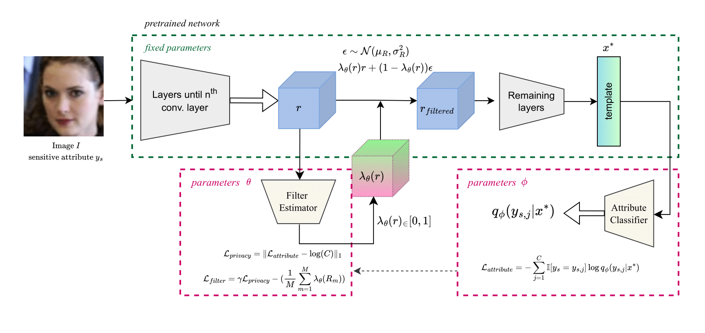

# Controllable Privacy in Face Recognition: A Filter-based Approach

This repository contains the the code for our paper:

> [**Controllable Privacy in Face Recognition: A Filter-based Approach**](https://ieeexplore.ieee.org/abstract/document/10504554)
> *Z Rezgui, N Strisciuglio, R Veldhuis*
> *IJCB, 2024*

Our research explores methods for balancing privacy protection and model utility in face recognition using adversarial training and information bottleneck-based techniques.

 

## 📌 Current Status

At the moment, this repository includes **only the training code** (`train.py`) and some utility files. Unfortunately, after graduating from my university, I lost access to the **pretrained models** that were stored on the university’s computing cluster and were not pushed to GitHub at the time.

Since I no longer have access to those files, I **won't be actively reconstructing** the missing components. However, if you're interested in using or extending the code, feel free to reach out. I’d be happy to assist with any issues.

## Getting Started

Although pretrained models are not available, you can still experiment with the **training pipeline** and adapt it to your own datasets. Check `config.py` to modify hyperparameters and file paths as needed.

### Prerequisites
We use **Poetry** for managing the project's dependencies. Poetry ensures that all required libraries are installed in a consistent and isolated environment.

Once you have Poetry installed, run the following command to install the project dependencies:

 ```sh
poetry install
```
This will install both the regular and development dependencies specified in `pyproject.toml` and lock the exact versions in the `poetry.lock` file.

Poetry automatically creates a virtual environment for the project. You can activate it with:
```sh
poetry shell
```
## 📖 Citation

If you use this code in your research, please cite our work:

```bibtex
@inproceedings{rezgui2024controllable,
  title={Controllable Privacy in Face Recognition: A Filter-based Approach},
  author={Rezgui, Zohra and Strisciuglio, Nicola and Veldhuis, Raymond},
  booktitle={2024 IEEE International Joint Conference on Biometrics (IJCB)},
  pages={1--9},
  year={2024},
  organization={IEEE}
}
